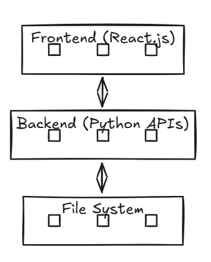

# Vision-op: Tele Operator Application

# Author: Shubham Singh

A web application that displays a laptop camera feed alongside point cloud visualization. The system handles real-time camera streaming, provides basic metrics, and includes recording capabilities.

## Features

1. **Point Cloud Visualization**:
   - Implements a 3D room viewer.
   - Includes basic camera controls: zoom, rotate, and pan.
2. **Camera Integration**:
   - Streams the laptop's webcam feed to the web interface.
   - Displays basic stream metrics.
   - Offers a recording functionality.

---

## Architecture Diagram




---

## Technology Stack

- **Frontend**: React.js
- **Backend**: Python (for file handling APIs)
- **3D Visualization**: Point cloud viewer library (e.g., Three.js or similar)

---

## Prerequisites

Ensure the following are installed:

- [Node.js](https://nodejs.org/) (v16 or higher)
- [Python](https://www.python.org/) (v3.8 or higher)

---

## Installation and Setup

1. **Clone the repository**:
   ```bash
   git clone https://github.com/shubhamsingh7272/Vision-op.git
   cd Vision-op
   ```

2. **Backend Setup**:
   - Navigate to the backend folder:
     ```bash
     cd teleoperator-backend
     ```
   - Install dependencies:
     ```bash
     pip install -r requirements.txt
     ```
   - Run the backend server:
     ```bash
     python app.py
     ```

3. **Frontend Setup**:
   - Navigate to the frontend folder:
     ```bash
     cd teleoperator-frontend
     ```
   - Install dependencies:
     ```bash
     npm install
     ```
   - Start the frontend server:
     ```bash
     npm start
     ```

---

## How to Run the Application

1. Start the backend server by following the backend setup instructions.
2. Start the frontend server by following the frontend setup instructions.
3. Open your browser and navigate to `http://localhost:3000` to access the application.

---

## Technical Decisions

- **React.js**: Chosen for its efficient component-based architecture and seamless state management.
- **Python**: Used for backend operations and file handling due to its simplicity and robust libraries.
- **Point Cloud Library**: Enables interactive 3D visualization and manipulation of point clouds.

---

## Known Limitations

- The application assumes a stable internet connection for streaming and recording.
- Performance may degrade with high-resolution streams on older devices.

---
## Contact & Support 📫

-   **Email**: shubham.s21@iiits.in
-   

## Contribution

Feel free to fork this repository and submit pull requests. For major changes, please open an issue first to discuss what you would like to change.

---

## License

This project is licensed under the MIT License. See the LICENSE file for details.

---

## Demo Video

[Demo Video](https://drive.google.com/drive/folders/1SXJjwyrRvArUXnCs5KkIKpO6VcBUZ5km)
